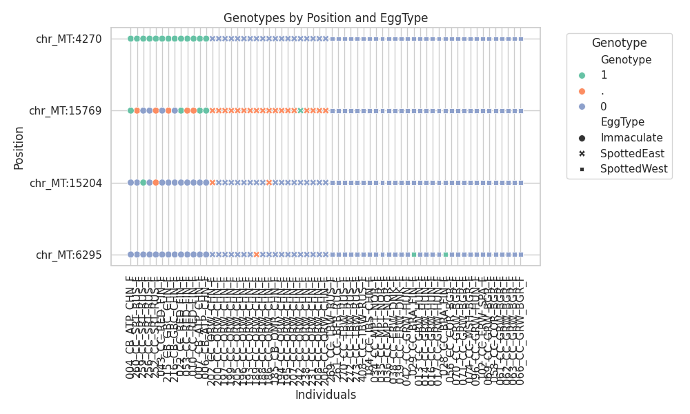
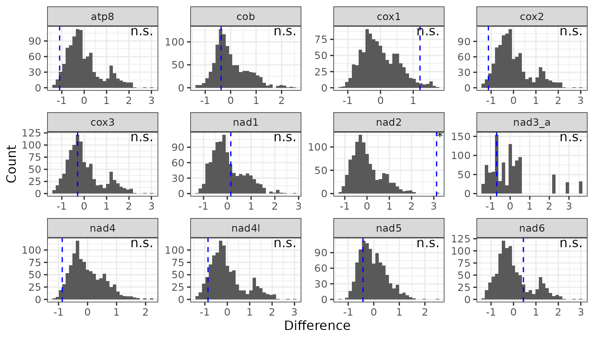

# merothon: daily runs with python

merothon is a collection of scripts designed for omic data, typically scripts I re-use frequently or are part of published papers.

## Table of Contents

- [Installation](#installation)
- [Scripts](#scripts)
  - [Calculating R2 All SNPs, 2 VCFS](#calculating-r2-all-snps-2-vcfs)
  - [Plot Genotypes from VCF](#plot-genotypes-from-vcf)
  - [Genomic Background Permutation Tests](#genomic-background-permutation-tests)
  - [Assign Ancestral Allele](#assign-ancestral-allele)

## Installation

Most of the basic dependencies you likely already have, but it is easily installable with a fresh environment and setup.py:

```
git clone https://github.com/merondun/merothon.git
mamba create -n merothon python=3.8
mamba activate merothon
#cd merothon #or wherever the git repo was downloaded
pip install -e .
```

## Scripts

### Calculating R2 All SNPs, 2 VCFS

Calculates LD (R2) between the SNP genotypes in 2 VCF files. This is useful for estimating LD for e.g. a mtDNA variant and the rest of the autosomal SNPs. 

NOTE: This only works correctly for biallelic SNPs. It works for variable ploidy (same output as plink --ld-window 999999999 --ld-window-kb 100000000 --ld-window-r2 0), but it won't output meaingful results for 3N, 4N sites. 

Example from /examples/ directory: `calculate_r2 --vcf1 chr_MT_Biallelic_SNPs.vcf.gz --vcf2 chr_MT_Target_SNP.vcf.gz --out chr_MT_LD.txt`

If you have any invariant or constant sites in your VCF, you will get a warning "ConstantInputWarning: An input array is constant; the correlation coefficient is not defined.", but it does not affect calculations for other sites (output will be nan). 

**OUTPUTS:**

| chrVCF1 | posVCF1 | chrVCF2 | posVCF2 | num_missing_genotypesVCF1 | num_missing_genotypesVCF2 | R2                         |
|---------|---------|---------|---------|---------------------------|---------------------------|----------------------------|
| chr_MT  | 44      | chr_MT  | 4270    | 0                         | 0                         | 0.3048275862068961         |
| chr_MT  | 192     | chr_MT  | 4270    | 0                         | 0                         | 0.20816783216783216        |
| chr_MT  | 196     | chr_MT  | 4270    | 0                         | 0                         | 0.19325217121588079        |

### Plot Genotypes from VCF

Plots color-coded genotypes for SNP positions. 

**INPUTS:**

Metadata with header (ID matches VCF sample IDS, any column (interpreted as string) to order individuals according to a phenotype). 

```
head Egg_Metadata.txt
ID      EggType
007_CB_ATP_CHN_F        Immaculate
006_CB_ATP_CHN_F        Immaculate
```

Positions to map (tab sep, NO HEADER): 

```
head Genotype_Inspect_Positions.txt
chr_MT  4270
chr_MT  6295
chr_MT  15204
chr_MT  15769
```

... vcf, column name for the phenotype to order, output name for png, 

Example from /examples/ directory: `plot_genotypes --vcf chr_MT_Biallelic_SNPs.vcf.gz --metadata Egg_Metadata.txt --pos Genotype_Inspect_Positions.txt --phenotype EggType --out Eggtype.png --size 50`

**OUTPUT:**



### Genomic Background Permutation Tests 

The command `permutation_test` first calculates the observed mean within a target region, and then performs *n* permutations where it samples an equal number of windows/sites within the target region from the remaining chromosomal background, shuffles the labels, and calculates the mean of each. Then it takes the difference between target$mean - background$mean, repeating this *n* times. 

**INPUTS (tab sep, NO HEADERS):**

* 4 column bed-style file with chr, start, end, value - where value is the metric of interest for permutations .

```
head chr_MT_log2CNV.bed
chr_MT  0       499     0.67175572519084
chr_MT  500     999     1.40123456790123
chr_MT  1000    1499    1.51666666666667
```

* 4 column bed-style file with the regions of interest, with chr, start, end, name - where each 'name' will be sampled *n* times.   

```
head chr_MT_Regions.bed
chr_MT  2823    3776    nad1
chr_MT  4025    5053    nad2
chr_MT  5429    6961    cox1
```

Example from /examples/ directory: `permutation_test --all_data chr_MT_log2CNV.bed --regions chr_MT_Regions.bed --out chr_MT_log2CNV_Permutations.txt --permutations 1000 --seed 101`

**OUTPUTS:**

 region $name, observed difference of mean value within region - mean value from background, and the number of windows/sites considered within the target region. Window overlap is INCLUSIVE, so if the region overlaps the genomic coordinates at all, it will be included. For base-pair data, simply encode $end as $start. 

```
head chr_MT_log2CNV_Permutations.txt
name    observed_difference     permuted_difference     num_target_windows
nad1    0.47178252726279357     0.14945085444127315     3
nad1    0.47178252726279357     0.26676949056649923     3
nad1    0.47178252726279357     0.4328325777830311      3
nad1    0.47178252726279357     -0.4311795501585062     3
nad1    0.47178252726279357     0.0506551308381018      3
nad1    0.47178252726279357     0.43651826959357676     3
nad1    0.47178252726279357     0.16896713077478842     3
nad1    0.47178252726279357     -0.30403482064694287    3
nad1    0.47178252726279357     -0.06806538194288803    3
```

Which can be plotted in R. You can assess significance based on how many permuted windows are above your observed value. Note potential adjustments due to 2-tailed tests:

```
library(tidyverse)
perm = read_tsv('~/merothon/examples/chr_MT_log2CNV_Permutations.txt')

#set p-threshold, and the number of tests performed for bonferonni correction 
alpha = 0.05 
num_tests = length(unique(perm$name))

#grab observed values, and calculate significance 
perm_results = perm %>%
  group_by(name) %>%
  summarize(
    obs = observed_difference[1],
    p_value = mean(abs(permuted_difference) >= abs(obs)),
    is_significant = ifelse(p_value < (alpha / num_tests),'*','n.s.')
  )

#plot histogram by gene
perm_plot = perm %>% ggplot(aes(x=permuted_difference))+
  geom_histogram()+
  geom_vline(data=perm_results,aes(xintercept=obs),lty=2,col='blue')+ #add vertical lines 
  geom_text(data=perm_results,aes(x=Inf,y=Inf,label=is_significant),vjust=1,hjust=1.2)+ #add significance label
  facet_wrap(name~.,scales='free')+
  theme_bw()
```



### Assign Ancestral Allele

The command `polarize_vcf` assigns a vcf INFO/AA field to a vcf (**must have index, e.g. bcftools index $vcf**). Simply provide a vcf, and output prefix (output will be gzipped), and a list of the outgroup samples, one per line. It works on haploid and diploid data. 

Polarizing logic: 
* If the outgroups are homozygous for an allele, assign that as the ancestral. 
* If the outgroups are all heterozygous, assign as unknown (AA=U). 
* If the outgroups are polymorphic (0/0 0/0 1/1), assign as unknown (AA=U).
* If there is missing data, but at least 1 outgroup is monomorphic, assign that allele as ancestral.
* If there is only missing data from the outgroups, assign as unknown (AA=U). 

**INPUTS:**

Indexed vcf, prefix for output, and an outgroups file:

```
cat ~/merothon/examples/Outgroups.list 
386_CP_MBW_RUS_M
387_CP_MBW_RUS_F
```

Example command (ran within ~/merothon/examples):

```
polarize_vcf --vcf chr_MT_Unpolarized.vcf.gz --out chr_MT_Polarized.vcf.gz --outgroups Outgroups.list
```

Check output logic:

```
bcftools view --samples-file Outgroups.list chr_MT_Polarized.vcf.gz.vcf.gz | bcftools query -f '%CHROM\t%POS\t%REF\t%ALT\t%INFO/AA[\t%GT]\n'
#CHR  POS REF ALT INFO/AA 386_CP_MBW_RUS_M  387_CP_MBW_RUS_F
chr_MT  691     G       A       A       1       1
chr_MT  1498    T       C       C       1       1
chr_MT  1912    T       C       T       0       0
chr_MT  4132    C       T       T       1       1
chr_MT  6139    C       T       U       .       .
chr_MT  6166    T       C       U       .       .
chr_MT  9864    A       G       U       .       .
chr_MT  11242   C       T       U       0       1
chr_MT  11406   C       T       C       .       0
chr_MT  11426   T       C       U       .       .
chr_MT  13029   T       C       C       1       1
chr_MT  13857   T       C       T       .       0
chr_MT  14037   A       G       U       .       .
chr_1   4839    C       A       U       0/1     0/1
chr_1   15306   G       A       U       0/1     1/1
chr_1   22822   C       A       C       0/0     0/0
chr_1   22843   T       C       C       1/1     ./.
chr_1   23004   A       G       U       ./.     ./.
```