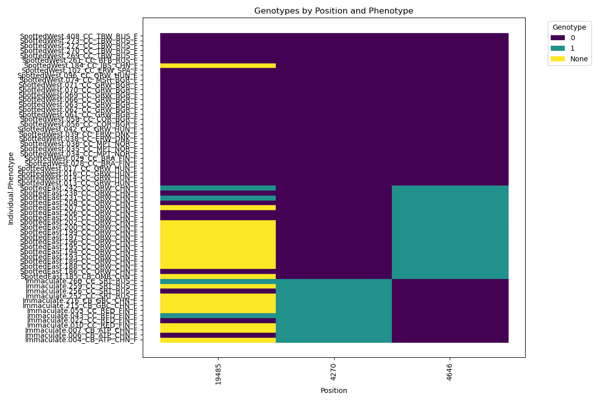

# merothon: daily runs with python

merothon is a collection of scripts designed for omic data, typically scripts I re-use frequently or are part of published papers.

## Table of Contents

- [Installation](#installation)
- [Scripts](#scripts)
  - [Calculating R2 All SNPs, 2 VCFS](#calculating-r2-all-snps-2-vcfs)
  - [Plot Genotypes from VCF](#plot-genotypes-from-vcf)
  - [Genomic Background Bootstrap Sampling](#genomic-background-bootstrap-sampling)
  - [Genomic Background Permutation Tests](#genomic-background-permutation-tests)

## Installation

Most of the basic dependencies you likely already have, but it is easily installable with a fresh environment and setup.py:

```
git clone https://github.com/merondun/merothon.git
mamba create -n merothon python=3.8
mamba activate merothon
#cd merothon #or wherever the git repo was downloaded
pip install -e .
```

## Scripts

### Calculating R2 All SNPs, 2 VCFS

Calculates LD (R2) between the SNP genotypes in 2 VCF files. This is useful for estimating LD for e.g. a mtDNA variant and the rest of the autosomal SNPs. 

NOTE: This only works correctly for biallelic SNPs. It works for variable ploidy (same output as plink --ld-window 999999999 --ld-window-kb 100000000 --ld-window-r2 0), but it won't output meaingful results for 3N, 4N sites. 

Example from /examples/ directory: `calculate_r2 --vcf1 chr_MT_Biallelic_SNPs.vcf.gz --vcf2 chr_MT_Target_SNP.vcf.gz --out chr_MT_LD.txt`

If you have any invariant or constant sites in your VCF, you will get a warning "ConstantInputWarning: An input array is constant; the correlation coefficient is not defined.", but it does not affect calculations for other sites (output will be nan). 

**OUTPUTS:**

| chrVCF1 | posVCF1 | chrVCF2 | posVCF2 | num_missing_genotypesVCF1 | num_missing_genotypesVCF2 | R2                         |
|---------|---------|---------|---------|---------------------------|---------------------------|----------------------------|
| chr_MT  | 44      | chr_MT  | 4270    | 0                         | 0                         | 0.3048275862068961         |
| chr_MT  | 192     | chr_MT  | 4270    | 0                         | 0                         | 0.20816783216783216        |
| chr_MT  | 196     | chr_MT  | 4270    | 0                         | 0                         | 0.19325217121588079        |

### Plot Genotypes from VCF

Plots color-coded genotypes for SNP positions. 

**INPUTS:**

Metadata with header (ID matches VCF sample IDS, any column (interpreted as string) to order individuals according to a phenotype). 

```
head Egg_Metadata.txt
ID      EggType
007_CB_ATP_CHN_F        Immaculate
006_CB_ATP_CHN_F        Immaculate
```

Positions to map (tab sep, NO HEADER): 

```
head Genotype_Inspect_Positions.txt
chr_MT  4270
chr_MT  6295
chr_MT  15204
chr_MT  15769
```

... vcf, column name for the phenotype to order, output name for png, 

Example from /examples/ directory: `plot_genotypes --vcf chr_MT_Biallelic_SNPs.vcf.gz --metadata Egg_Metadata.txt --pos Genotype_Inspect_Positions.txt --phenotype EggType --out Eggtype.png --size 50`

**OUTPUT:**



### Genomic Background Bootstrap Sampling

The command `bootstrap_sample` takes the difference of a value within a target region from the chromosomal background, *n* times.

**INPUTS (tab sep, NO HEADERS):**

* 4 column bed-style file with chr, start, end, value - where value is the metric to bootstrap.

```
head chr_MT_log2CNV.bed
chr_MT  0       499     0.67175572519084
chr_MT  500     999     1.40123456790123
chr_MT  1000    1499    1.51666666666667
```

* 4 column bed-style file with the regions of interest, with chr, start, end, name - where each 'name' will be sampled *n* times.   

```
head chr_MT_Regions.bed
chr_MT  2823    3776    nad1
chr_MT  4025    5053    nad2
chr_MT  5429    6961    cox1
``` 

Example from /examples/ directory: `bootstrap_sample --all_data chr_MT_log2CNV.bed --regions chr_MT_Regions.bed --out chr_MT_log2CNV_Bootstraps.txt --events 10000 --seed 101`

Simply outputs the region $name, followed by the difference between the sampling event (target$value - background$value). Window overlap is INCLUSIVE, so if the region overlaps the genomic coordinates at all, it will be included. For base-pair data, simply encode $end as $start. Set seed for reproducibility. 

**OUTPUTS:**

```
head chr_MT_log2CNV_Bootstraps.txt
name    difference
nad1    0.8559393036678461
nad1    0.82442748091603
nad1    1.29146341463415
nad1    -0.25465178096757013
nad1    0.6697076894433099
nad1    0.4207115079936601
nad1    1.0559316337798261
```

### Genomic Background Permutation Tests 

The command `permutation_test` first calculates the observed mean within a target region, and then performs *n* permutations where it samples an equal number of windows/sites within the target region from the remaining chromosomal background, shuffles the labels, and calculates the mean of each. Then it takes the difference between target$mean - background$mean, repeating this *n* times. 

**INPUTS (tab sep, NO HEADERS):**

* 4 column bed-style file with chr, start, end, value - where value is the metric of interest for permutations .

```
head chr_MT_log2CNV.bed
chr_MT  0       499     0.67175572519084
chr_MT  500     999     1.40123456790123
chr_MT  1000    1499    1.51666666666667
```

* 4 column bed-style file with the regions of interest, with chr, start, end, name - where each 'name' will be sampled *n* times.   

```
head chr_MT_Regions.bed
chr_MT  2823    3776    nad1
chr_MT  4025    5053    nad2
chr_MT  5429    6961    cox1
```

Example from /examples/ directory: `permutation_test --all_data chr_MT_log2CNV.bed --regions chr_MT_Regions.bed --out chr_MT_log2CNV_Permutations.txt --permutations 10000 --seed 101`

**OUTPUTS:**

 region $name, observed difference of mean value within region - mean value from background, and the number of windows/sites considered within the target region. Window overlap is INCLUSIVE, so if the region overlaps the genomic coordinates at all, it will be included. For base-pair data, simply encode $end as $start. 

```
head chr_MT_log2CNV_Permutations.txt
name    observed_difference     permuted_difference     num_target_windows
nad1    0.47178252726279357     -0.4249724771896157     3
nad1    0.47178252726279357     -0.039267334628042105   3
nad1    0.47178252726279357     0.03729247279701875     3
nad1    0.47178252726279357     0.1692817454684601      3
nad1    0.47178252726279357     0.43651826959357654     3
nad1    0.47178252726279357     0.5655407357906946      3
nad1    0.47178252726279357     -0.03926733462804188    3
nad1    0.47178252726279357     0.5722156240092797      3
```
