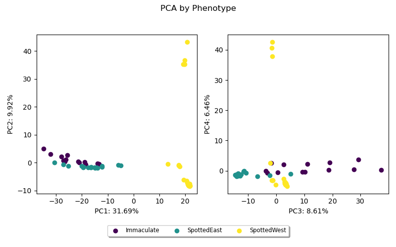

# merothon: daily runs with python

merothon is a collection of scripts designed for omic data, typically scripts I re-use frequently or are part of published papers.

## Table of Contents

- [Installation](#installation)
- [Scripts](#scripts)
  - [VCF to PCA](#vcf-to-pca)
  - [Plot LD](#plot-ld)
  - [Identify Chromosomes in Scaffold Assembly](#identify-chromosomes-in-scaffold-assembly)
  - [Plot Genotypes from VCF](#plot-genotypes-from-vcf)
  - [Genomic Background Permutation Tests](#genomic-background-permutation-tests)
  - [Assign Ancestral Allele](#assign-ancestral-allele)
  - [Calculating R2 All SNPs, 2 VCFS](#calculating-r2-all-snps-2-vcfs)
  - [Count Fasta Mutations](#count-fasta-mutations)

## Installation

Installation (only unix tested) is easiest with conda (or preferably mamba..!):

For newest version, it's best to just pull and install with pip:

```
git clone git@github.com:merondun/merothon.git
cd merothon
pip install -e .
map_chromosomes -h 
```

With conda (`v0.3.0`)

```
conda config --add channels merothon
conda create -n merothon merothon
```

The package requires scikit-allel, so there are quite some dependencies. also installable with a fresh environment and setup.py:

```
git clone https://github.com/merondun/merothon.git
mamba create -n merothon python=3.8
mamba activate merothon
#cd merothon #or wherever the git repo was downloaded
pip install .
```

## Contact

For any questions or concerns, please open an issue on this repository or reach out to me (Justin Merondun): heritabilities@gmail.com

## Scripts

### VCF to PCA

Creates a PCA from a VCF, centering genotypes and scaling (Patterson's), as is standard, as implemented with `scikit-allel`. Shows axes 1-4 with variation explained. Color-coded by a metadata file and a specified population / phenotype of interest. 

**INPUTS:**

* `--vcf` VCF file, gzipped. Runs quite fast - on 325K SNps with n=95 finished in less than 2 minutes. 
* `--out` Name for the output plot. Indicate .png if you want png, or .pdf if you want pdf.
* `--metadata` optional, Metadata txt file with header (tab sep, ID matches VCF sample IDS, any column (interpreted as string) to color individuals according to a phenotype). 
* `--phenotype` optional (required if --metadata passed) Indicates column from the metadata to color PCA points with  
* `--label` optional, if you want to add individual ID labels on the PCA.

Example command (from `~/merothon/examples/`): 

```
vcf_to_pca --vcf chr_MT_Biallelic_SNPs.vcf.gz --metadata Egg_Metadata.txt --phenotype EggType --out chr_MT-Egg.png
```

**OUTPUTS:**



The script will also output a table with the ID and PC scores: 

```
head chr_MT-Egg_PCA_results.txt
SampleID        PC1     PC2     PC3     PC4
004_CB_ATP_CHN_F        -32.053032      2.9825137       27.599659       0.3857217
006_CB_ATP_CHN_F        -34.71451       5.0182424       37.388523       0.21636803
007_CB_ATP_CHN_F        -27.910244      2.1165054       18.682531       0.19745003
010_CC_RED_FIN_F        -20.966307      0.060952943     11.145772       2.2917793
013_CC_GRW_HUN_F        21.225214       -8.073826       3.522668        -4.487747
014_CC_GRW_HUN_F        21.115448       -7.9420753      3.4580698       -4.373293
016_CC_GRW_HUN_F        20.696783       43.30594        -0.16141385     -4.655875
```

And a txt with the percent variation explained: 

```
cat chr_MT-Egg_values.txt
PC      Explained Variance
PC1     0.31688836
PC2     0.09920925
PC3     0.08608831
PC4     0.064572975
``` 

---

### Plot LD

Simple script to visualize LD. Runs in about 1 minute with low memory on a plink output up to 70K SNPs (28M comparisons; ~2 Gb plink `.ld` file). It will likely require higher RAM for whole-chromosome plots. 

Plink LD file can be created like:

```
plink --allow-extra-chr --double-id --vcf chr_6.vcf.gz --r2 --out chr_6 --ld-window 999999999 --ld-window-kb 1000000000
```

**INPUTS:**

* `--input` PLINK LD file. 
* `--out` Name for the output plot. Indicate .png if you want png, or .pdf if you want pdf.
* `--win_size` Window size in KB to average LD within. Recommended 5 / 10 KB.  
* `--highlight` optional, will highlight region specified `--highlight 4000-7500`

Input file should look like this:

```
CHR_A         BP_A SNP_A  CHR_B         BP_B SNP_B           R2
 chr_6     26782411    .  chr_6     26782682    .     0.431694
 chr_6     26782411    .  chr_6     26783389    .     0.415234
 chr_6     26782411    .  chr_6     26783390    .     0.415234
```

Example command (from `~/merothon/examples/`): 

```
plot_ld --input inversion/chr_6_LD.ld --out chr_6.png --win_size 10 --highlight 29890958-31208777
```

**OUTPUTS:**


The script will also output a table with mean LD in the specified windows: 

```
head chr_6.png_windows.txt
BP_A_bin        BP_B_bin        R2
27890000        27890000        0.49573512930011865
27890000        27900000        0.41180526204340917
27890000        27910000        0.30092458594917787
27890000        27920000        0.2833754210526316
27890000        27930000        0.34322271005154636
```

---

### Identify Chromosomes in Scaffold Assembly

This script takes as input a `PAF` alignment file between a draft and reference, a `.fai` index from the draft, and identifies which scaffolds correspond to which reference chromosomes. 

```
minimap2 -x asm20 ${REFERENCE_FASTA} draft.fa --secondary=no -t ${THREADS} -o ref_to_asm.paf
samtools faidx draft.fa

map_chromosomes ref_to_asm.paf draft.fa.fai draft_chromosomes.txt
```

**INPUTS:**

* `--paf` PAF alignment file between chromosome-level reference and draft assembly.
* `--fai` Samtools index file for the draft genome. 
* `--min_size` Minimum scaffold size, in Mb.  
* `--out` outfile.


**OUTPUTS:**

A text file, e.g. `map.txt` with these columns: 

**Scaffold:** The scaffold name from the draft genome. 
**Chromosome:** The reference chromosome to which the scaffold aligns most. 
**Alignment Percentage:** The percentage of the scaffold's total length that aligns to the chosen chromosome. 
**Scaffold Length:** The total length of the scaffold in bp. 
**Predominant Strand:** The strand (‘+’ or ‘-’) that has the majority alignment. 

```
scaffold_3      Chr03   46.81%  26619930        +
scaffold_4      Chr04   70.76%  30141089        +
scaffold_5      Chr05   79.21%  26038907        +
scaffold_6      Chr06   61.29%  33441831        +
scaffold_7      Chr07   80.63%  34284707        +
scaffold_8      Chr08   73.61%  36794498        +
scaffold_9      Chr09   71.37%  29494829        +
scaffold_10     Chr10   66.20%  35785193        +
```


---

### Plot Genotypes from VCF

Plots color-coded genotypes for SNP positions. 

**INPUTS:**

Metadata with header (ID matches VCF sample IDS, any column (interpreted as string) to order individuals according to a phenotype). 

```
head Egg_Metadata.txt
ID      EggType
007_CB_ATP_CHN_F        Immaculate
006_CB_ATP_CHN_F        Immaculate
```

* `--metadata` sheet (above)
* `--vcf` (gzipped, indexed)
* `--pos` list of positions, separated by comma (chr_MT:4270,1:2370)
* `--phenotype` phenotype to order by, column from metadata sheet
* `--out` output png. 

Example from /examples/ directory:

```
plot_genotypes --vcf chr_MT_Biallelic_SNPs.vcf.gz --metadata Egg_Metadata.txt --pos chr_MT:19485,chr_MT:4270,chr_MT:4646 --phenotype EggType --out Eggtype.png
```

**OUTPUT:**


---

### Genomic Background Permutation Tests 

The command `permutation_test` first calculates the observed mean within a target region, and then performs *n* permutations where it samples an equal number of windows/sites within the target region from the remaining chromosomal background - without replacement, shuffles the labels, and calculates the mean of each. Then it takes the difference between target$mean - background$mean, repeating this *n* times. 

**INPUTS (tab sep, NO HEADERS):**

* 4 column bed-style file with chr, start, end, value - where value is the metric of interest for permutations .

```
head chr_MT_log2CNV.bed
chr_MT  0       499     0.67175572519084
chr_MT  500     999     1.40123456790123
chr_MT  1000    1499    1.51666666666667
```

* 4 column bed-style file with the regions of interest, with chr, start, end, name - where each 'name' will be sampled *n* times.   

```
head chr_MT_Regions.bed
chr_MT  2823    3776    nad1
chr_MT  4025    5053    nad2
chr_MT  5429    6961    cox1
```

* `--all_data` file with all the data to permute, format above 
* `--regions` file with the regions
* `--out` output file
* `--permutation` number of permutations

Example from /examples/ directory: `permutation_test --all_data chr_MT_log2CNV.bed --regions chr_MT_Regions.bed --out chr_MT_log2CNV_Permutations.txt --permutations 1000 --seed 101`

**OUTPUTS:**

 region $name, observed difference of mean value within region - mean value from background, and the number of windows/sites considered within the target region. Window overlap is INCLUSIVE, so if the region overlaps the genomic coordinates at all, it will be included. For base-pair data, simply encode $end as $start. 

```
head chr_MT_log2CNV_Permutations.txt
name    observed_difference     permuted_difference     num_target_windows
nad1    0.47178252726279357     0.14945085444127315     3
nad1    0.47178252726279357     0.26676949056649923     3
nad1    0.47178252726279357     0.4328325777830311      3
nad1    0.47178252726279357     -0.4311795501585062     3
nad1    0.47178252726279357     0.0506551308381018      3
nad1    0.47178252726279357     0.43651826959357676     3
nad1    0.47178252726279357     0.16896713077478842     3
nad1    0.47178252726279357     -0.30403482064694287    3
nad1    0.47178252726279357     -0.06806538194288803    3
```

Which can be plotted in R. You can assess significance based on how many permuted windows are above your observed value. Note potential adjustments due to 2-tailed tests:

```
library(tidyverse)
perm = read_tsv('~/merothon/examples/chr_MT_log2CNV_Permutations.txt')

#set p-threshold, and the number of tests performed for bonferonni correction 
alpha = 0.05 
num_tests = length(unique(perm$name))

#grab observed values, and calculate significance 
perm_results = perm %>%
  group_by(name) %>%
  summarize(
    obs = observed_difference[1],
    p_value = mean(abs(permuted_difference) >= abs(obs)),
    is_significant = ifelse(p_value < (alpha / num_tests),'*','n.s.')
  )

#plot histogram by gene
perm_plot = perm %>% ggplot(aes(x=permuted_difference))+
  geom_histogram()+
  geom_vline(data=perm_results,aes(xintercept=obs),lty=2,col='blue')+ #add vertical lines 
  geom_text(data=perm_results,aes(x=Inf,y=Inf,label=is_significant),vjust=1,hjust=1.2)+ #add significance label
  facet_wrap(name~.,scales='free')+
  theme_bw()
```


---

### Assign Ancestral Allele

The command `polarize_vcf` assigns a vcf INFO/AA field to a vcf (**must have index, e.g. bcftools index $vcf**). Simply provide a vcf, and output prefix (output will be gzipped), and a list of the outgroup samples, one per line. It works on haploid and diploid data. 

Polarizing logic: 
* If the outgroups are homozygous for an allele, assign that as the ancestral. 
* If the outgroups are all heterozygous, assign as unknown (AA=U). 
* If the outgroups are polymorphic (0/0 0/0 1/1), assign as unknown (AA=U).
* If there is missing data, but at least 1 outgroup is monomorphic, assign that allele as ancestral.
* If there is only missing data from the outgroups, assign as unknown (AA=U). 

**INPUTS:**

```
cat ~/merothon/examples/Outgroups.list 
386_CP_MBW_RUS_M
387_CP_MBW_RUS_F
```

* `--vcf` vcf
* `--out` output prefix (will be gzipped)
* `--outgroups` list of outgroup samples, one per line

Example command (ran within ~/merothon/examples):

```
polarize_vcf --vcf chr_MT_Unpolarized.vcf.gz --out chr_MT_Polarized --outgroups Outgroups.list
```

Check output logic:

```
bcftools view --samples-file Outgroups.list chr_MT_Polarized.vcf.gz.vcf.gz | bcftools query -f '%CHROM\t%POS\t%REF\t%ALT\t%INFO/AA[\t%GT]\n'
#CHR    POS    REF     ALT   INFO/AA 386_CP_MBW_RUS_M  387_CP_MBW_RUS_F
chr_MT  691     G       A       A       1       1
chr_MT  1498    T       C       C       1       1
chr_MT  1912    T       C       T       0       0
chr_MT  4132    C       T       T       1       1
chr_MT  6139    C       T       U       .       .
chr_MT  6166    T       C       U       .       .
chr_MT  9864    A       G       U       .       .
chr_MT  11242   C       T       U       0       1
chr_MT  11406   C       T       C       .       0
chr_MT  11426   T       C       U       .       .
chr_MT  13029   T       C       C       1       1
chr_MT  13857   T       C       T       .       0
chr_MT  14037   A       G       U       .       .
chr_1   4839    C       A       U       0/1     0/1
chr_1   15306   G       A       U       0/1     1/1
chr_1   22822   C       A       C       0/0     0/0
chr_1   22843   T       C       C       1/1     ./.
chr_1   23004   A       G       U       ./.     ./.
```

---

### Calculating R2 All SNPs, 2 VCFS

Calculates LD (R2) between the SNP genotypes in 2 VCF files. This is useful for estimating LD for e.g. a mtDNA variant and the rest of the autosomal SNPs. 

NOTE: This only works correctly for biallelic SNPs. It works for variable ploidy (same output as plink --ld-window 999999999 --ld-window-kb 100000000 --ld-window-r2 0), but it won't output meaingful results for 3N, 4N sites. 

**INPUTS:**

* `--vcf1` first VCF
* `--vcf2` second VCF 
* `--out` output file 

```
calculate_r2 --vcf1 chr_MT_Biallelic_SNPs.vcf.gz --vcf2 chr_MT_Target_SNP.vcf.gz --out chr_MT_LD.txt
```

If you have any invariant or constant sites in your VCF, you will get a warning "ConstantInputWarning: An input array is constant; the correlation coefficient is not defined.", but it does not affect calculations for other sites (output will be nan). 

**OUTPUTS:**

| chrVCF1 | posVCF1 | chrVCF2 | posVCF2 | num_missing_genotypesVCF1 | num_missing_genotypesVCF2 | R2                         |
|---------|---------|---------|---------|---------------------------|---------------------------|----------------------------|
| chr_MT  | 44      | chr_MT  | 4270    | 0                         | 0                         | 0.3048275862068961         |
| chr_MT  | 192     | chr_MT  | 4270    | 0                         | 0                         | 0.20816783216783216        |
| chr_MT  | 196     | chr_MT  | 4270    | 0                         | 0                         | 0.19325217121588079        |

---

### Count Fasta Mutations

The command `count_mutations` is a simple multi-sequence alignment fasta summary script. It takes as input an MSA in fasta format and a reference ID for an individual to use as a reference, and outputs the number of bases, the number of mutations between each individual and the reference, the number of Ns or gap characters (-) between each individual and reference, and the total number of polymorphic sites. 

**INPUTS:**

* `--fasta` fasta multisequence alignment
* `--reference` individual ID from fasta to compare against all other sequences
* `--out` output summary 

Command from `/examples/`:

```
count_mutations --fasta chr_MT.fasta --reference 013_CC_GRW_HUN_F --out chr_MT.mutations.txt
```

**OUTPUTS:**

```
cat chr_MT.mutations.txt
sequence_id     sequence_length num_mutations   num_N_and_gaps  num_polymorphic
004_CB_ATP_CHN_F        21      3       2       8
007_CB_ATP_CHN_F        21      3       0       8
010_CC_RED_FIN_F        21      4       0       8
013_CC_GRW_HUN_F        21      0       0       8
016_CC_GRW_HUN_F        21      1       0       8
202_CC_ORW_CHN_F        21      6       0       8
259_CC_SRT_RUS_F        21      3       0       8
260_CC_SRT_RUS_F        21      3       0       8
261_CC_BFB_RUS_F        21      0       5       8
269_CC_TBW_RUS_F        21      0       3       8
270_CC_TBW_RUS_F        21      0       0       8
```

Check sequences manually:

```
#for reference:
>013_CC_GRW_HUN_F
CGATCAGCGCGTAAGCGGGAG

#0 mutations
>270_CC_TBW_RUS_F
CGATCAGCGCGTAAGCGGGAG
CGATCAGCGCGTAAGCGGGAG #ref

#0 mutations, 3 gaps/Ns 
>269_CC_TBW_RUS_F
CGAT-ANCGCGTAAGCGGGAN
CGATCAGCGCGTAAGCGGGAG #ref 

#3 mutations, 2 gaps 
>004_CB_ATP_CHN_F
CGATCAGCGTGTTANCGNGCG
CGATCAGCGCGTAAGCGGGAG #ref 
```
