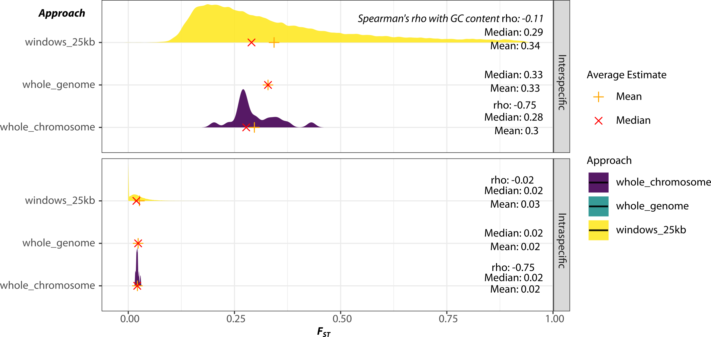

## Assess FST Estimates, Different Approaches

Determine differences between FST calculated across all sites genome-wide simultaneously vs. chromosome-wide vs. in windows. Relatively minor filters, just MQ, DP, and QUAL20, using pixy. 2 comparisons: 2 intraspecific and 2 interspecific. 


## FST, chromosome-wide and 25kb

Calculate FST for each chromosome, using the entire chromosome length as a window size: 

```bash
#!/bin/bash

#SBATCH --get-user-env
#SBATCH --mail-user=merondun@bio.lmu.de
#SBATCH --clusters=biohpc_gen
#SBATCH --partition=biohpc_gen_highmem
#SBATCH --cpus-per-task=20
#SBATCH --time=200:00:00

TMPDIR=/dss/dsslegfs01/pr53da/pr53da-dss-0021/tmp

for CHR in $(cat Chromosomes.list); do

length=$(grep -w ${CHR} GCA_017976375.1_bCucCan1.pri_genomic.CHR.genome | awk '{print $2}')

echo "WORKING ON ${CHR} WITH LENGTH ${length}"
tabix full_vcf/${CHR}.MQ20-DP150-Q20.vcf.gz
pixy --stats fst --bypass_invariant_check yes --vcf full_vcf/${CHR}.MQ20-DP150-Q20.vcf.gz --populations Samples_Demography_N10_CCW-CCE-COW-COE-CCM-CCN_2024APR17.pop --window_size $length --n_cores 10 --output_folder fst --output_prefix ${CHR}

#also calculate in 25KB
pixy --stats fst --bypass_invariant_check yes --vcf full_vcf/${CHR}.MQ20-DP150-Q20.vcf.gz --populations Samples_Demography_N10_CCW-CCE-COW-COE-CCM-CCN_2024APR17.pop --window_size 25000 --n_cores 2 --output_folder fst --output_prefix ${CHR}_25


done 
```


## FST, pseudo-encoded whole genome

Calculate FST, first combining all chromosomes into a single scaffold called 'genome', and calculating FST over the entire genome:

```bash
#!/bin/bash

#SBATCH --get-user-env
#SBATCH --mail-user=merondun@bio.lmu.de
#SBATCH --clusters=biohpc_gen
#SBATCH --partition=biohpc_gen_normal
#SBATCH --cpus-per-task=2
#SBATCH --time=48:00:00

#bcftools concat -Oz -o concatenated.vcf.gz --file-list FILES.list
#bcftools index concatenated.vcf.gz
#tabix concatenated.vcf.gz

OUT=Genomewide.vcf.gz
TOTAL_LENGTH=20000000

#initialize variable to keep track of the cumulative position shift
new_position=1

echo "##fileformat=VCFv4.2" | bgzip > ${OUT}
echo "##contig=<ID=genome,length=$TOTAL_LENGTH>" | bgzip >> ${OUT}
bcftools view -h full_vcf/chr_1.MQ20-DP150-Q20.vcf.gz | egrep -v '^##contig|fileformat=VCFv4.2' | bgzip >> ${OUT}

# Process each chromosome
for CHR in $(cat Chromosomes.list); do
    echo "Processing $CHR..."
    #Extract the current chromosome, adjust the CHROM field, and positions
    bcftools view -H full_vcf/${CHR}.MQ20-DP150-Q20.vcf.gz | awk -v n=${new_position} -v OFS='\t' '{
        $1="genome"; $2=NR+n;
        print;
    }' | bgzip >> ${OUT}

    #update new position for the next set of variants
    last_pos=$(zcat Genomewide.vcf.gz | tail -n 1 | awk '{print $2}')
    new_position=$((last_pos + 1))
done

#index
bcftools index ${OUT}
tabix ${OUT}

TMPDIR=/dss/dsslegfs01/pr53da/pr53da-dss-0021/tmp

#or length=$(bcftools index -n Genomewide.vcf.gz)
length=46316606

pixy --stats fst --bypass_invariant_check yes --vcf ${OUT} --populations Samples_Demography_N10_CCW-CCE-COW-COE-CCM-CCN_2024APR17.pop --window_size $length --n_cores 2 --output_folder fst --output_prefix genome
```

## GC-content 

And calculate GC content:

```bash
genome=/dss/dsslegfs01/pr53da/pr53da-dss-0021/assemblies/Cuculus.canorus/VGP.bCucCan1.pri/GCA_017976375.1_bCucCan1.pri_genomic.CHR.fa

seqkit sliding ${genome} -s 25000 -W 25000 | seqkit fx2tab -n -g | sed 's/_sliding:/\t/g' | sed 's/-/\t/g' > Genome_GCContent_25KB.bed

#and for each chr
rm Genome_GCContent_CHR.bed
for CHR in $(cat Chromosomes.list); do

samtools faidx ${genome} ${CHR} > chr.tmp
length=$(grep -w ${CHR} GCA_017976375.1_bCucCan1.pri_genomic.CHR.genome | awk '{print $2}')
seqkit sliding chr.tmp -s ${length} -W ${length} | seqkit fx2tab -n -g | sed 's/_sliding:/\t/g' | sed 's/-/\t/g' >> Genome_GCContent_CHR.bed

done 
```


## Plot 

And plot:

```R
.libPaths('~/mambaforge/envs/R/lib/R/library')
setwd('/dss/dsslegfs01/pr53da/pr53da-dss-0021/projects/2023__MigratoryGenomics/analyses/msmc/')
library(tidyverse)
library(viridis)
library(meRo)

#import FST genome-wide
g1 = read_tsv('/dss/dsslegfs01/pr53da/pr53da-dss-0021/projects/2023__MigratoryGenomics/analyses/msmc/from_raw_vcf/fst/genome_fst.txt')
g1$approach = 'whole_genome'
g1$GC = NA

#import FST chr-wide
c1 = read_tsv('/dss/dsslegfs01/pr53da/pr53da-dss-0021/projects/2023__MigratoryGenomics/analyses/msmc/from_raw_vcf/fst/chrs_fst.txt')
c1$approach = 'whole_chromosome'

#import FST window-based
w1 = read_tsv('/dss/dsslegfs01/pr53da/pr53da-dss-0021/projects/2023__MigratoryGenomics/analyses/msmc/from_raw_vcf/fst/windows_fst.txt')
w1$approach = 'windows_25kb'

#add GC content, chrs 
gc_chr = read_tsv('/dss/dsslegfs01/pr53da/pr53da-dss-0021/projects/2023__MigratoryGenomics/analyses/msmc/from_raw_vcf/Genome_GCContent_CHR.bed',col_names = F)
names(gc_chr) = c('chromosome','start','end','GC')
c2 = left_join(c1,gc_chr %>% select(-start,-end))

#add GC content, windows 
gc_chr = read_tsv('/dss/dsslegfs01/pr53da/pr53da-dss-0021/projects/2023__MigratoryGenomics/analyses/msmc/from_raw_vcf/Genome_GCContent_25KB.bed',col_names = F)
names(gc_chr) = c('chromosome','window_pos_1','window_pos_2','GC')
w2 = left_join(w1,gc_chr)

d = rbind(g1,c2,w2) %>% 
  mutate(chromosome = gsub('chr_','',chromosome),
         Group = paste0(pop1,'_',pop2),
         FST = pmax(0,pmin(1,avg_wc_fst)))
d = d %>% filter(grepl('COE_COW|CCE_COE',Group)) %>% 
  mutate(Comparison = ifelse(grepl('CC',pop1) & grepl('CO',pop2),'Interspecific',
                             ifelse(grepl('CO',pop1) & grepl('CC',pop2),'Interspecific','Intraspecific')))

#calculate mean/median summary stats for chromosome and window based 
dmean = d %>% group_by(Group,Comparison,approach) %>% sum_stats(FST)
dmean

#correlations between FST and GC content 
d %>% group_by(approach,Comparison) %>% filter(!grepl('whole_genome',approach)) %>% 
  summarize(cor = cor(GC,FST,method='spearman',use='pairwise.complete.obs'))


#plot 
dfst = d %>% 
  ggplot(aes(x=FST,y=approach,fill=approach))+
  ggdist::stat_halfeye(adjust = .5,width = .3,.width = 0,trim=FALSE,justification = 0, point_colour = NA,alpha = 0.9,normalize='groups')+
  geom_point(data=dmean,aes(x=mean,y=approach,col='Mean'),inherit.aes=FALSE,pch=3,size=2)+
  geom_point(data=dmean,aes(x=median,y=approach,col='Median'),inherit.aes=FALSE,pch=4,size=2)+
  geom_text(data=dmean,aes(x=0.8,y=approach,label=paste0('Mean: ',round(mean,2))),vjust=1)+
  geom_text(data=dmean,aes(x=0.8,y=approach,label=paste0('Median: ',round(median,2))),vjust=-1)+
  facet_grid(Comparison~.,scales='free')+
  scale_color_manual(values=c('Mean'='orange','Median'='red'))+
  ylab('Group')+xlab('FST')+
  scale_fill_viridis(discrete=TRUE)+
  theme_bw(base_size=8)

pdf('FST_By_Approach_2024APR22.pdf',height=3.5,width=7)
dfst
dev.off()

```

